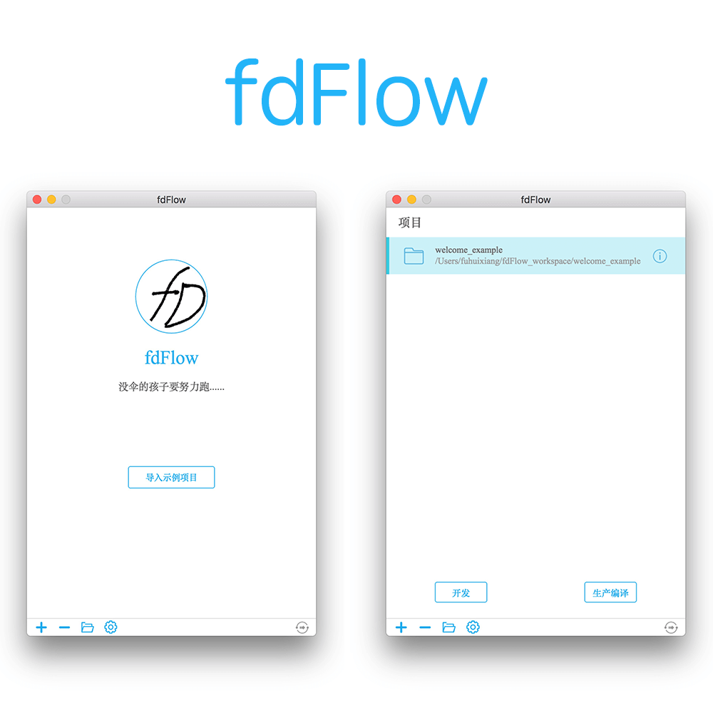

# nuts-desktop
一个支持全平台的图像界面版前端工具流。

这个软件是我另外一个命令行工具流 [nuts](https://github.com/F-happy/nuts) 的图形界面版本。
与命令行版本不同的是，这个 GUI 版本的支持的功能也会更多更复杂，而且在 win 平台上由于对命令行显示的效果也不是很满意，所以才萌发了开发一个全平台通用的工具流软件，目前这个软件已经可以在 Mac 平台上顺利运行了，接下来的就是在 win 平台上顺利编译出对应版本的安装包来。

## 功能：
- 预编译：
目前的版本在 css 上的预编译选择的是 scss，因为个人喜好，所以在 css 预编译语言的选择上我选择了更熟悉的 scss 作为编译语言。而在 JavaScript 代码上选择的是 ES6 版本，并且默认打开支持两种语言的预编译，虽然这两种预编译同时支持向下兼容，但是如果你不希望使用的话也可以在配置页面中将其关闭。

- 代码压缩混淆：
在开发模式中都是不对代码进行压缩和混淆的，为了方便定位代码，而在编译发布模式下将会对 JavaScript 和 css 代码做压缩，同时混淆 JavaScript 代码。

- 静态图片一键导入：
或许在页面重构中经常需要导入图片地址作为 scss 的变量，所以我提供了一键将 images 文件夹下的图片自动导入到 scss 文件中，并且为了不影响主样式文件，将会单独建立名称为 ```_static.scss``` 的文件（这个功能仅仅支持在 scss 模式下）。

- CDN 前缀自动补全：
很多时候我们的资源是发布到 CDN 上面的，所以我们的代码需要在引用前加上 CDN 的路径，这是一个无聊的事情，所以我帮你做了~在配置文件中设置好 CDN 路径就可以在编译模式下自动补全了（开发者模式下无效）。

- 本地静态服务器：
每次我们在修改完代码之后就需要手动刷新页面，这很浪费，所以，在期待一个项目的时候我都会启动一个本地的静态资源服务器来提供自动刷新页面的功能，同时还会自动检测文件的改动来自动触发。（文件，字体等资源不支持）

## 界面预览



## 开发环境

* Electron 版本：v1.4.3
* Node 版本 ：v6.6.0

# 本地保存的数据结构
```javascript
fdFlow = {
    "workspace": "/Users/fuhuixiang/fdFlow_workspace",
    "projects": {
        "welcome_example": {
            "path": "/Users/fuhuixiang/fdFlow_workspace/welcome_example"
        },
        "welcome_example2": {
            "path": "/Users/fuhuixiang/fdFlow_workspace/welcome_example"
        }
    }
};
```

# 配置文件说明
```javascript
{
	// 项目作者
    "author": "jonnyf",
    
    // 编译是否需要添加 cdn
    "needCDN": false,
    
    // 默认的CDN路径
    "staticURL": "http://cdn.jonnyf.com",
    
    // 目标路径中静态文件需要放置的目录
    "staticDir": "static",
    
    // 本地开发服务器监听的端口号
    "serverPort": 2333,
    
    // 开发环境中的源码路径
    "sourceDir": "src",
    
    // 开发环境中需要开发的项目名称
    "name": "example",
    
    // 代码中的字符串替换内容
    "replaceStr": 666,
    
    // 引入的 sass 库,默认采用了 nuts-scss 库,使用时需要先安装。传入的值需要是一个数组。
    // 'sassLib': []
    "sassLib": [
        "nuts-scss"
    ]
}
```